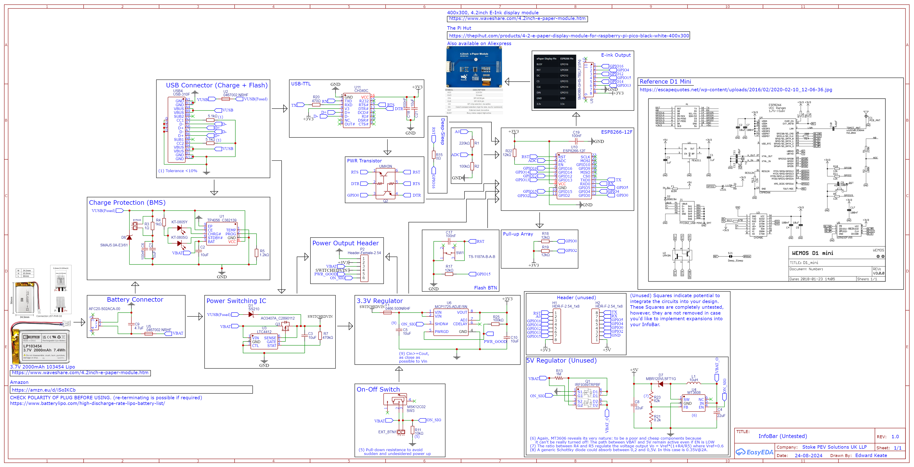

  

---

> **Avalon:** "The isle of the dead, an island paradise where King Arthur and other heroes are taken after death"

The Avalon Project is an open-source Self-Balancing-Electric-Skateboard project focused on affordability, power, and usability. All PCB, CAD, Code and project files can be find inside this repository.
> Distributed under the [Apache 2.0 License](https://www.apache.org/licenses/LICENSE-2.0). Read [LICENSE.md](LICENSE.md)

---

- [Odyssey](Odyssey) Flagship 134.4V 1KWh+ Performance System **(ETA Q3 2024)**
- [Apollo:](Apollo) Capable 138.8V 500Wh+ Pocket Rocket **(ETA Q4 2024)**
- [Fenrir:](Fenrir) Powerful 100.8V 400Wh+ Lightweight Commuter **(ETA Q1 2025)**

>See also: [InfoBar](infobar), E-ink external display for the Avalon Series

---

> On the [Odyssey](https://www.britannica.com/topic/Odyssey-epic-by-Homer), Odysseus faces numerous trials, including monsters and gods, on his decade-long journey home from the Trojan War to Ithaca.

The **Odyssey** is the Flagship board in the **Avalon Series** of self-balancing boards. Boasting a voltage range of 100.8V to 134.4V, 1KWh+ of capacity, 700+ Lumen lighting, IMU wake detection, Fingerprint Sensing, no compromises were taken during the design process. 

> Please read [Odyssey Board Disclaimer](#odyssey-board-disclaimer)

### Features
- Voltage(V): 134.4V to 100.8V
- Range(Km): 50-90 (134.4V), 40-60 (100.8V)
- Speed: [Yes](https://www.youtube.com/watch?v=zXf44tSWhBQ) (Over 2000W+ compared to video)
- 10 x [70-100 Lumen White LEDs](https://www.lcsc.com/datasheet/lcsc_datasheet_2309141627_JNJ-OPTOELECTRONICS-JNJ-LTJH0111W60-26mil-8000-9000K_C7500127.pdf) (PWM Configurable)
- 22 x [SK68812RGBW](https://cdn-shop.adafruit.com/product-files/2757/p2757_SK6812RGBW_REV01.pdf) Addressable LEDs
- [Fingerprint Sensor](https://cdn.shopify.com/s/files/1/0176/3274/files/104474-datasheet.pdf?v=1650622001) with user profiles and logging
- [ESPHome](https://esphome.io/) integration

### Powertrain 
- Controller: [JetFleet F6](https://www.jetfleet.store/product/15108255/controller-jetfleet-f6), [TRONIC X12](https://tronicsystems.com/products/x12-bareboard-no-enclosure), [ENNOID-ESC MK8](https://www.ennoid.me/esc/150v-esc)
- BMS: [ENNOID-BMS Master-XLITE](https://www.ennoid.me/bms/master-xlite), [ENNOID-BMS XLITE-V4](https://www.ennoid.me/bms/xlite-v4), [Flipsky 4S-30S 20A BMS](https://flipsky.net/collections/bms/products/flipsky-4s-30s-20a-bms-protection-board-hardware-ternary-polymer-lithium-battery-only-charge-bms-board-for-onewheel-ebike-eskateboard-euc)
- Cells: [Molicel P42A](https://www.molicel.com/wp-content/uploads/INR21700P42A-V4-80092.pdf), [Molicel P45B](https://www.molicel.com/wp-content/uploads/INR21700P45B_1.2_Product-Data-Sheet-of-INR-21700-P45B-80109.pdf), [Samsung 50S](https://www.dnkpower.com/wp-content/uploads/2022/07/SAMSUNG-INR21700-50S-Cell-Specification.pdf), [EVE 40P](https://www.rcscomponents.kiev.ua/datasheets/INR21700_40P.pdf?srsltid=AfmBOor8f9CQmFkExNRTm6Mq1A_Q03pWzBJgzzz9d33UfN2aQRMcYi1Q), [Samsung 40T](https://www.dnkpower.com/wp-content/uploads/2019/02/SAMSUNG-INR21700-40T-Datasheet.pdf), [TenPower 40TG](https://www.tenpowercell.com/wp-content/uploads/2022/12/TP-INR21700-40TG-Product-Datasheet-v1.4.1.pdf), [Sony VT6A](https://www.imrbatteries.com/content/murata_us21700vtc6a.pdf)
> If you are unsure what Cell, Controller or BMS to use for this board, consider consulting an experienced VESC builder for assembly assistance. Please refer them to this repository

## Odyssey Parts

- [Odyssey Control Board](#odyssey-control-board)
- [Odyssey Lightsym Bars](#odyssey-lightsym-bar)
- [Odyssey Controller Box](#odyssey-controller-box)
- [Odyssey Battery Box](#odyssey-battery-box)
- [Odyssey Rails](#odyssey-rails)
- [Odyssey Footpads](#odyssey-footpads)
- [Odyssey Bumpers](#odyssey-bumpers)
- [Odyssey Fender](#odyssey-fender)
- [Odyssey Axle Blocks](#odyssey-axle-blocks)
- [Avalon Series Tools & Hardware](#Avalon-Series-Tools--Hardware)

## Odyssey Control Board

[EasyEDA Files](Odyssey/Control%20Board/PCBs/EasyEDA)
[ESP32 Code + Flashing](Odyssey/Control%20Board/Code)

The **Odyssey Control Board** is designed inside [EasyEDA](EasyEDA.com) and is intended to be assembled using [JLCPCB Economic Assembly](https://jlcpcb.com/capabilities/pcb-assembly-capabilities). 

The Control Board communicates with/powers:
- The [R503-M22 Fingerprint Sensor](https://cdn.shopify.com/s/files/1/0176/3274/files/104474-datasheet.pdf?v=1650622001) 
- 2 x [Odyssey Lightsym Bars](#odyssey-lightsym-bar)
- ESP Home integration using an [Espressif Systems ESP32-WROOM-32E-N8](https://www.lcsc.com/datasheet/lcsc_datasheet_2403071012_Espressif-Systems-ESP32-WROOM-32E-N8_C701342.pdf) as the [MCU](https://en.wikipedia.org/wiki/Microcontroller)
- VESC Power ([SSR Relay](https://www.lcsc.com/datasheet/lcsc_datasheet_1808101047_TOSHIBA-TLP172GM-TPL-E-O_C261926.pdf) control)

The Control board is an **Always-On** Deep-Sleep system. The ultra-efficient design and massive battery pack allows for an ~2 years battery life. Below shows an example of how to calculate this (5V, 10mA~avg~, 89%~eff~):
$$
T = \frac{3.6 \times 5 \times 30 \times 2}{\frac{5 \times 0.01}{0.89}} \approx 19223 \text{ hours}
$$
>You will also need to purchase parts from [Digikey](https://www.digikey.co.uk/en/mylists/list/NP048JOWBK). See [Electronics Purchasing Guide](#Electronics-Purchasing-Guide) for more information.

> The Odyssey Control Board is uses the high voltage battery DC input. Ensure proper safety measures are used to prevent damage to ~~battery~~ everything ~~within 5 mile radius~~.
#### Schematic

  

#### PCB

**Top**

  

**Bottom**

  

> Control Boards are designed for expandability. A powerful and efficient 5V rail is integrated into the Schematics, but not the PCB or BOM. See [files](Odyssey/Control%20Board/PCBs/EasyEDA) for more information.

## Odyssey LightSym Bar
[EasyEDA Files](Odyssey/LightSym%20Bar/PCBs/EasyEDA)

The **Odyssey LightSym Bar** is designed inside [EasyEDA](EasyEDA.com) and is intended to be assembled using [JLCPCB Economic Assembly](https://jlcpcb.com/capabilities/pcb-assembly-capabilities). 

The LightSym Bar has 15 inputs:
- 5 x 5V
- 2 x 3V3
- 2 x NTC100K
- 2 x BRTL
- 2 x BRTR
- 1 x Din
- 1 x GND

The labels on these inputs correlates with the labels on the [Odyssey Control Board](#odyssey-control-board).
> You will also need to purchase parts from [Digikey](https://www.digikey.co.uk/en/mylists/list/NP048JOWBK). See [Electronics Purchasing Guide](#Electronics-Purchasing-Guide) for more information.
#### Schematic

  

#### PCB

**Top**

  

**Bottom**

  

## Odyssey Controller Box
[CAD Files](Odyssey/Controller%20Casing)

The **Odyssey Controller Box** is a split pack enclosure designed for 6S2P 21700. For Controller & Cell options, please see the [Powertrain](#powertrain) section. 
### Features:
- **Dual** [TPU](https://formlabs.com/uk/blog/complete-guide-tpu-3d-printing/) O-ring
- [R503-M22 Fingerprint Sensor](https://cdn.shopify.com/s/files/1/0176/3274/files/104474-datasheet.pdf?v=1650622001) 
- [Superflux Connector](https://www.fungineers.us/products/superflux-female-connector)
- Dual Compartment Design
- M20 Gland Hole
- Steel reinforcement bolt system
>See the [Odyssey 3D Printing Guidelines](#Odyssey-3D-Printing-Guidelines) for information on how to manufacture your Controller Box.
#### Image

  

#### Render

  

## Odyssey Battery Box
[CAD Files](Odyssey/Battery%20Casing)

The **Odyssey Battery Box** has capacity for 24S2P 21700. For cell and BMS options, please see the [Powertrain](#powertrain) section. 
### Features:
- **Dual** [TPU](https://formlabs.com/uk/blog/complete-guide-tpu-3d-printing/) O-ring
- [GX16](https://www.sunrom.com/download/663.pdf) Charge port
- M20 Gland Hole
- Steel reinforcement bolt system
>See the [Odyssey 3D Printing Guidelines](#Odyssey-3D-Printing-Guidelines) for information on how to manufacture your Battery Casing.
#### Image

  

#### Render

  

## Odyssey Series Rails
[CAD Files](Odyssey/Rails)

The **Odyssey Series** has several unique rail designs. Find yours here:
- [Odyssey Rails](#Odyssey-rails)
- [Odyssey Rails (Skeletonised)](#Odyssey-rails)
### Odyssey Rails (Skeletonised)
The Flagship rails. Designed to be **light-weight** and strong using a completely unique skeletisation design. 
**Statistics:**
- 12" wheel-well (BTG)
- Unique "Trace" skeletisation
- 5°lowered, 3° lifted
- 4° tail lift
#### Image

**Left Rail**

  

  

**Right Rail**

  

  

### Odyssey Rails
Cheaper Flagship rails. Designed to be **light-weight** and strong at a lower cost. 
**Statistics:**
- 12" wheel-well (BTG)
- 5°lowered, 3° lifted
- 4° tail lift
>See the [Avalon Machining Guidelines](#Avalon-Machining-Guidelines) for information on how to manufacture your Rails.
#### Image

  

  

**Right Rail**

  

  

## Odyssey Footpads

[CAD Files](Odyssey/Footpads)

The **Odyssey Footpads** take inspiration from [Stanley Shaw's](https://vow.systems/) [Mushies](https://vow.systems/products/gt-mushies). Go check out his designs!

**Features:**
- Supports hard([PLA](https://help.prusa3d.com/article/pla_2062), [ASA](https://help.prusa3d.com/article/asa_1809)) or Soft ([TPU](https://ninjatek.com/shop/ninjaflex/)) [FDM](https://www.hubs.com/knowledge-base/what-is-fdm-3d-printing/) printing for hard or soft footpads
- Mirrored pads (Same design front and rear)
- Light Concave
- Super thin for locked-in feel

#### Image

  

#### Render

  

>See the [Odyssey 3D Printing Guidelines](#Odyssey-3D-Printing-Guidelines) for information on how to manufacture your Footpads.

## Odyssey Bumpers
[CAD Files](Odyssey/Bumpers)

The **Odyssey Bumpers** are ultra-durable symmetrical bumpers designed for CNC [UHMWPE](https://www.hubs.com/cnc-machining/plastic/hdpe/uhmwpe/) or [FDM](https://www.hubs.com/knowledge-base/what-is-fdm-3d-printing/) manufacturing. 

**Features:**
- Supports [FDM](https://www.hubs.com/knowledge-base/what-is-fdm-3d-printing/) printing or [UHMWPE](https://www.hubs.com/cnc-machining/plastic/hdpe/uhmwpe/) manufacturing.
- Symmetrical front and back bumpers
- Ultra-thin, yet durable
- Multiple Mounting configurations
#### Image

  

#### Render

  

>See both the [Odyssey 3D Printing Guidelines](#Odyssey-3D-Printing-Guidelines) and [Avalon Machining Guidelines](#Avalon-Machining-Guidelines) to determine your manufacturing method.
>
## Odyssey Fender
[CAD Files](Odyssey/Fender)

The **Odyssey Fenders** are optional add-ons for your Odyssey board that further protect the [Odyssey Battery Box](#odyssey-battery-box) and [Odyssey Controller Box](#odyssey-controller-box) from corrosion.

**Features:**
- Super small [FDM](https://www.hubs.com/knowledge-base/what-is-fdm-3d-printing/) print
- Integrated shell covers for O-rings and Connectors to further protect against water ingress.

#### Image

  

  

>See the [Odyssey 3D Printing Guidelines](#Odyssey-3D-Printing-Guidelines) for information on how to manufacture your Fenders.

## Odyssey Axle Blocks
[CAD Files](Odyssey/Axle%20Blocks)
TBD

# Odyssey 3D Printing Guidelines
> If you aren't used to 3D printing or don't know where to start, I would recommend consulting an expert. Due to the dangerous nature of all self-balancing devices, 3D prints need to be strong, accurate and reliable.

## Solid Prints
Below, you can find the material recommendations and mechanical requirements for **SOLID** 3D prints for the **Odyssey Series** of Board. 

### Minimum Specification
These are the absolute minimum requirements for 3D printing the **Odyssey series** solid components:
- Print Volume: 350mm x 350mm x 150mm 
- Material: [ABS](https://www.prusa3d.com/category/asa-abs/), [ASA](https://www.prusa3d.com/category/prusament-asa/), [PETG](https://www.prusa3d.com/category/prusament-petg/)
- Wall Thickness: 2-3x nozzle diameter
- Infill: >15%
> [How to make 3D prints waterproof](https://all3dp.com/2/waterproof-3d-print-pla/)
### Recommended Specification
- Material: [PC-CF](https://www.prusa3d.com/product/prusament-pc-blend-jet-black-970g/), [PA (Nylon)](https://www.prusa3d.com/category/prusament-pa-nylon/)
- [Support Material](https://dddrop.com/3d-printing-with-support-material/) (Ideally [Water Soluble](https://www.stratasys.com/en/materials/materials-catalog/fdm-materials/fdm-support-materials/#:~:text=Soluble%20support%20is%20most%20effective,submerged%20in%20the%20dissolution%20tank.))
- Infill: >20% ([Honey Pattern](https://all3dp.com/2/get-cura-honeycomb-infill/))

## Flexible Prints

Below, you can find the material recommendations and mechanical requirements for **FLEXIBLE** 3D prints for the **Odyssey Series** of Board.
### Minimum Specification
These are the absolute minimum requirements for 3D printing the **Odyssey series** flexible components
- Print Volume: 350mm x 350mm x 100mm 
- Material: [TPU](https://ninjatek.com/shop/ninjaflex/)
- Infill: 100%

> You are expected to find your own 3D printer that meets these requirements. If this is outside of your budget, consider a 3D printing service.

---

### Odyssey Board Disclaimer

>The Odyssey is, by far, the heaviest and largest board ever made. This is a personal proof of concept/hobby for myself to show the absolute insanity of todays open-source/manufacturing technology and is NOT meant to be a consumer product. If you are passionate, and I mean PASSIONATE about Balance Boards, this is your next project.

>The Avalon Series is based upon [ESPHome](https://esphome.io/) so that others can build upon the simple, yet powerful [YAML language](https://esphome.io/guides/getting_started_command_line.html) it uses. Some of the schematics have in-built but unused experimental modules for modification. For example, the [InfoBar](#infobar) (as of V1.0.0) does not use any 5V electronics, yet the schematic includes a 5V buck converter for the Battery. This is excluded from the [BOM](https://jlcpcb.com/help/article/bill-of-materials-for-pcb-assembly) and PCB, however it would be fairly easy to integrate with little [PMIC](https://en.wikipedia.org/wiki/Power_management_integrated_circuit) experience. I understand that electronics are not for everyone, however I would love to see more people getting into the nitty gritty and picking up electronics as a hobby.

>If you do decide to build this board, you will never need a more powerful, longer range or higher speed board. As an experienced VESC builder and PCB designer, this has every technology that I currently understand implemented and turned up to 11, it's not meant to be simple to build, nor is it intended to be mass produced. The Pathfiner and Questor are much more practical, yet significantly less capable boards, however they are for the everyman, this is not.

>Another important note is the license. I am using the [Apache 2.0 License](http://www.apache.org/licenses/LICENSE-2.0) as it offers protection over liability and warranty (I am not a legal professional). This is not a malicious attempt to shift blame to the builder, but a way to protect myself against legal action. [Self-balancing devices are inherently dangerous](https://www.lawsuit-information-center.com/onewheel-injury-lawsuits-against-future-motion.html) and I am in no way a proffessional, I find it important that I can continue to work on this project for the forseeable future without concerns over venturing into new technologies. 

>I have no plans to profit from these designs, nor do I have any plans to sell boards directly, especially since that would be [illegal](https://patents.google.com/patent/US9101817B2/en). However, I am available to comission to assemble some of the more complicated components.

---

# Apollo

> Swift and tireless, [Apollo](https://www.britannica.com/topic/Apollo-Greek-mythology) races the sun across the sky each day, his boundless energy unmatched, guiding light and life with unyielding endurance.

The **Apollo** is the Lightest board in the **Avalon Series** of self-balancing boards. Boasting a 126.8V to 134.4V, 500Wh+ Capacity and 300+ Lumen lighting, the Apollo is the ideal Pocket Rocket. Contains Avalon exclusive features such as: IMU wake detection, Fingerprint Sensing, ESPHome integration etc.

> Please read [Apollo Board Disclaimer](#apollo-board-disclaimer)

### Features
- Voltage(V): 126.8V to 134.4V
- Range(Km): 30-40 (134.4V), 25-35 (126.8V)
- Speed: [Yes](https://www.youtube.com/watch?v=zXf44tSWhBQ)
- [Fingerprint Sensor](https://cdn.shopify.com/s/files/1/0176/3274/files/104474-datasheet.pdf?v=1650622001) with user profiles and logging
- [ESPHome](https://esphome.io/) integration

> **Files relating to the Apollo are currently in a private reposity. Information about the board will be released closer to release.**

---

# Fenrir

> A monstrous wolf in Norse mythology, [Fenrir](https://www.britannica.com/topic/Fenrir) is destined to bring about Ragnarök, breaking free from his chains to devour Odin.

The **Fenrir** is the Cheapest board in the **Avalon Series** of self-balancing boards. Utilising 92.8V, 400Wh+ Capacity and 300+ Lumen lighting, the Fenrir is an ultra-durable Split-Pack Trick Board. Contains Avalon exclusive features such as: IMU wake detection, Fingerprint Sensing, ESPHome integration etc.

> Please read [Fenrir Board Disclaimer](#fenrir-board-disclaimer)

### Features
- Voltage(V): 92.8V
- Range(Km): 25-40
- Speed: 25mph+
- [Fingerprint Sensor](https://cdn.shopify.com/s/files/1/0176/3274/files/104474-datasheet.pdf?v=1650622001) with user profiles and logging
- [ESPHome](https://esphome.io/) integration

> **Files relating to the Fenrir are currently in a private reposity. Information about the board will be released closer to release.**

---

# InfoBar
The InfoBar is an [ESPHome](https://esphome.io/) based [E-ink display](https://www.waveshare.com/4.2inch-e-paper-module.htm) with [Automatic PSU switching](https://www.lcsc.com/datasheet/lcsc_datasheet_2304140030_Analog-Devices-LTC4412IS6-TRPBF_C521306.pdf), [Single Cell BMS](https://www.lcsc.com/datasheet/lcsc_datasheet_1912111437_TPOWER-TP4056_C382139.pdf) and a single [USB-C](https://www.lcsc.com/datasheet/lcsc_datasheet_1811151656_HOOYA-USB-310F-B-SU_C309365.pdf) for flashing and charging.
### Features
- 6-month battery life
- 4.2 inch 400x600 resolution [E-ink display](https://www.waveshare.com/4.2inch-e-paper-module.htm)
- Pre-ride weather information (requires configuration)
- Board statistics display (Updates every 5 minutes)
- User Log (Requires [R503 Fingerprint Sensor](https://cdn.shopify.com/s/files/1/0176/3274/files/104474-datasheet.pdf?v=1650622001))
> The InfoBar can only send/receive information to other devices on the ESPHome system. Do not attempt to integrate with your VESC-based speed controller as this will cause memory and pin allocation issues which will inevitably brick your VESC-based speed controller (The [Odyssey Control Board](#Odyssey-Control-Board) is isolated for a reason)

> User log is stored inside Sensor memory. **Your Biometric data will never be shared to or stored by other individuals without your consent**. 

### Schematic

  

### PCB

TBD

## Assembly
Based on the excellent [HA Sensor ePaper Display](https://github.com/maxmacstn/HA-ePaper-Display) by [Sitinut Waisara](https://github.com/maxmacstn).

# Avalon Machining Guidelines
> CNC Manufacturing is expensive, consider taxes, shipping and economy of scale before ordering. If you are a VESC technician considering producing any number of **Avalon Series** Boards, shoot me a message regarding machining.

[hubs.com](https://www.hubs.com)

Below, you can find the guidelines and how-to for manufacturing the .STEP files provided for each CNC component.

### Minimum Specification
These are the absolute minimum requirements for CNC manufacturing **Avalon Series** products:
- Material: [AlMg1SiCu](https://www.hubs.com/cnc-machining/metal/aluminum/aluminum-6061/), [AlSi1MgMn](https://www.hubs.com/cnc-machining/metal/aluminum/aluminum-6082/)
- [Post-Process:](https://www.hubs.com/knowledge-base/surface-finishes-cnc-machinings/) [Bead Blasting](https://www.hubs.com/surface-finishing-services/bead-blasting-services/) / None
### Recommended Specification
- Material: [AlZn5](https://www.hubs.com/cnc-machining/metal/aluminum/aluminum-7075-6/)
- [Post-Process:](https://www.hubs.com/knowledge-base/surface-finishes-cnc-machinings/) [Anodization](https://www.hubs.com/knowledge-base/what-is-anodizing/) [Type II or Type III](https://www.hubs.com/knowledge-base/type-ii-vs-type-iii-anodizing-what-does-your-project-require/)

If you **DO NOT** opt for Anodization or another form of post-processing, please ensure you choose a **non-corrosive** metal! 
> You are not expected to know anyone with a CNC Machine. If you happen to, these rails will probably exceed their Machine bed max dimensions. 
> 
# Electronics Purchasing Guide
The **Avalon Series** uses several thousand unique and specialist parts to operate. As these cannot all come from the same source, some assembly is required. 
## Digikey
[Digi-Key](https://www.digikey.com/) is a **global distributor** of electronic components, offering a vast selection of products, tools, and resources for engineers and makers. They are incredibly reliable and a **highly recommended** purchase option.

> You can find a full list of every part I use to make **Avalon Series Boards** via this [Digikey Shared List](https://www.digikey.co.uk/en/mylists/list/NP048JOWBK). You can also source some of the parts from [LCSC](https://www.lcsc.com/) when you purchase the PCBs.

## Adafruit Industries

If you've got the cash, [Adafruit Industries](https://www.adafruit.com/) is a super reliable website supporting great people. I have used plenty of their guides and datasheets to create these boards, so show them some love!

## Aliexpress
If you're working on a budget, Aliexpress offers cheaper but less reliable hardware. Try to avoid purchasing parts from here, but if you do, here's what to watch out for:

 - **Reviews**. 4 Stars+ and 10 reviews is my benchmark, but that may not be easy to find. Also read reviews as bots are rife on the electronics side of Aliexpress. 
 - **Brand**. Sometimes products you can purchase are not identical to the datasheets provided, this may cause communication problems between components. Ideally products are associated with the appropriate brand, this is especially important with powertrain electronics. (Don't buy an Aliexpress VESC)
 - **Connections**. All PCBs have been designed to be compatible with parts from the [Adafruit Industries](https://www.adafruit.com/) website, some products may look similar, but use different connectors. This will require soldering/crimping to fix. 

> **DO NOT** purchase replacement PCB components from Aliexpress. If you require an SMD fix, purchase from [LCSC](https://www.lcsc.com/) or an equivalent from [Digikey](https://www.digikey.com/)

# Avalon Series Tools &Hardware
The **Avalon Series** requires a lot of tools and miscellaneous parts to assemble. Here is a list of the most important, but not all of the products required to assemble your board.

This section only covers the physical mounting hardware, for electronic parts, see individual components. 
> Tool & Part Links are listed in format: "Name: UK Distributor / US Distributor" where applicable.

> If you're planning on wet riding, ensure you choose [parts resistant to corrosion (A4)](https://www.accu.co.uk/p/114-grades-of-austenitic-stainless-steel#:~:text=and%20UNS%20S30400.-,A4,harsh%20chemical%20and%20outdoor%20environments.).

## Tools
- Pinecil V2 Soldering Iron: [Global](https://pine64.com/product/pinecil-smart-mini-portable-soldering-iron/)
- Wera Kraftform Standard: [UK](https://www.accu.co.uk/bitholding-tools/644674-05051274001) / [US](https://accu-components.com/us/bitholding-tools/644674-05051274001)
- T6 Torx Bit: [UK](https://www.accu.co.uk/drive-bits/636302-HDB-H-T6-HS) / [US](https://accu-components.com/us/drive-bits/636302-HDB-H-T6-HS)
- T10 Torx Bit: [UK](https://www.accu.co.uk/drive-bits/636288-HDB-H-T10-HS) / [US](https://accu-components.com/us/drive-bits/636288-HDB-H-T10-HS)
- T25 Torx Bit: [UK](https://www.accu.co.uk/drive-bits/636292-HDB-H-T25-HS) / [US](https://accu-components.com/us/drive-bits/636292-HDB-H-T25-HS)
> If you're working on a budget, a precision screwdriver set can be a good idea. 
## Parts
- M2 x 6mm T6 Torx Pan Head Screws: [UK](https://www.accu.co.uk/hexalobular-pan-head-screws/475310-SHP-M2-6-V2-A4) / [US](https://accu-components.com/us/hexalobular-pan-head-screws/475310-SHP-M2-6-V2-A4)
- M2 x 3mm x 3.5mm: [UK](https://amzn.eu/d/bMJwggv) / [US](https://a.co/d/7rllooY)
 - M3 x 8mm T10 Torx Countersunk Screws: [UK](https://www.accu.co.uk/metric-torx-countersunk-screws/474332-SHK-M3-8-V2-A4) / [US](https://accu-components.com/us/metric-torx-countersunk-screws/474680-SHK-M3-8-V2-A4-BL)
 - M3 x 4mm x 5mm Brass Inserts: [UK](https://amzn.eu/d/eGp4Ldr) / [US](https://a.co/d/0UTHYOB)
 - M5 x 16mm T25 Torx Countersunk Screws: [UK](https://www.accu.co.uk/metric-torx-countersunk-screws/474743-SHK-M5-16-V2-A4-BL) / [US](https://accu-components.com/us/metric-torx-countersunk-screws/474744-SHK-M5-16-V2-A4-BL)
 - M5 x 8mm L x 7mm Brass Inserts: [UK](https://amzn.eu/d/6vIgD88) / [US](https://a.co/d/f2SdH9I)

> The websites listed are wholesalers due to the large number of duplicate parts. If you haven't used a wholesaler before, try and aim for the lowest price break so you have spares and save money. 

# Notice
- Please for the love of god, if you have my number somehow, do not text or call me. This has been an issue previously.

# License
Copyright 2024 Edward Keate
   
Licensed under the Apache License, Version 2.0 (the "License");
you may not use this file except in compliance with the License.
You may obtain a copy of the License at

 > http://www.apache.org/licenses/LICENSE-2.0

Unless required by applicable law or agreed to in writing, software
distributed under the License is distributed on an "AS IS" BASIS,
WITHOUT WARRANTIES OR CONDITIONS OF ANY KIND, either express or implied.
See the License for the specific language governing permissions and
limitations under the License.
